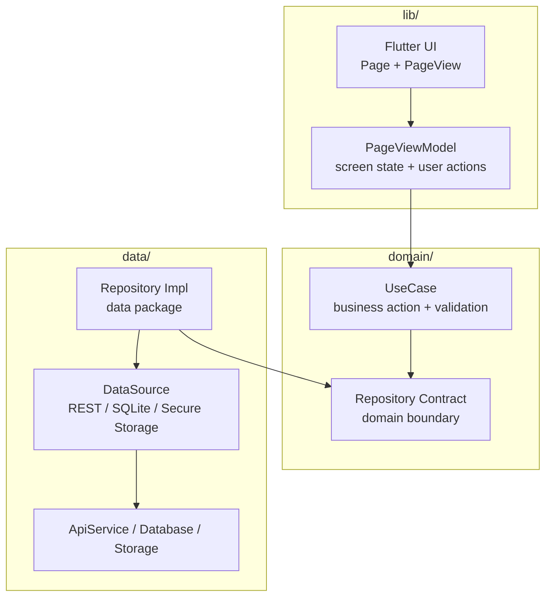
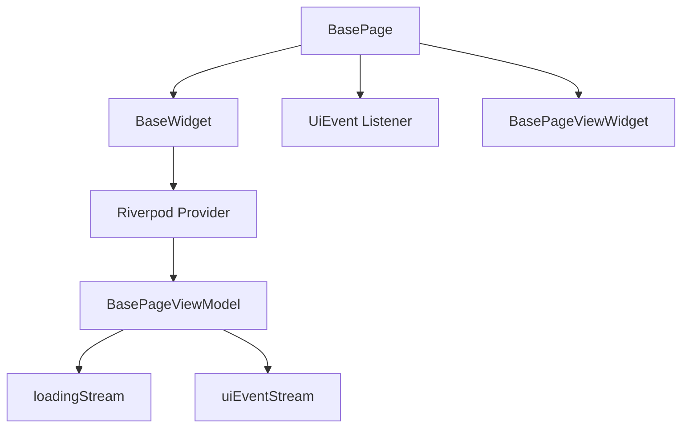
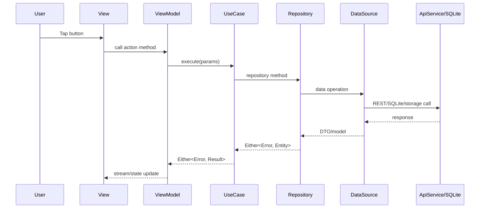

# KickStack Architecture

KickStack is a company-standard Flutter clean architecture starter. It is built
for production teams that need consistent feature structure, strict layer
boundaries, reusable base classes, REST, SQLite, secure storage, SSL setup, and
AI-friendly rules.

## Layer Diagram



Dependency direction:

```text
lib -> domain
lib -> data only for dependency wiring and app bootstrapping
data -> domain
domain -> no Flutter app or data dependency
```

## Company Page Standard

Every screen follows this pattern:

```text
FeaturePage
-> FeaturePageView
-> FeaturePageViewModel
-> UseCase
-> Repository contract
-> Repository implementation
-> DataSource
```

### Page

`FeaturePage` extends `BasePage<ViewModel>`.

Responsibilities:

- Provide the view model provider.
- Configure scaffold-level behavior.
- Trigger initial loading in `onModelReady`.
- Do not contain business logic.

### PageView

`FeaturePageView` extends `BasePageViewWidget<ViewModel>`.

Responsibilities:

- Render widgets.
- Use localized strings.
- Use `AppColors` or theme values.
- Use `AppStreamBuilder` for streams.
- Forward user actions to the view model.
- Do not call use cases, repositories, data sources, or APIs.

### PageViewModel

`FeaturePageViewModel` extends `BasePageViewModel`.

Responsibilities:

- Own screen state.
- Call use cases.
- Expose streams/state used by the UI.
- Emit `UiEvent` through base methods such as `showToastWithError`.
- Use `setLoading(event.status == Status.LOADING)` for request loading.

## Base Class Diagram



## Data Flow



## Request Flow

Use `RequestManager` when a view model calls a use case:

```dart
RequestManager<ResultType>(
  params,
  createCall: () => useCase.execute(params: params),
).asFlow().listen((event) {
  setLoading(event.status == Status.LOADING);
});
```

`RequestManager` handles:

- `Params.verify()`
- loading resource
- success resource
- transformed app errors
- unexpected exceptions

## Error Flow

```text
Data failure
-> BaseError subtype
-> transform()
-> AppError
-> BasePageViewModel.showToastWithError()
-> UiEvent
-> BasePage snackbar
```

Keep starter errors minimal. Add feature-specific error types only when a real
product requirement needs them.

## Folder Responsibility

```text
lib/base                  company page/viewmodel foundation
lib/core/theme            app theme and color tokens
lib/di                    app-level providers
lib/main                  app startup, routing, MaterialApp
lib/presentation          screens/features
lib/ui                    shared UI atoms and components
lib/utils                 app-level helpers

domain/lib/entities       business entities
domain/lib/repository     repository contracts
domain/lib/usecase        business actions
domain/lib/errors         app/domain errors

data/lib/remote           Retrofit API and network utilities
data/lib/source           remote/local/network data sources
data/lib/repository       repository implementations
data/lib/models           DTOs and local models
data/lib/helper           SQLite and secure storage helpers
data/lib/di               data-layer providers
```

