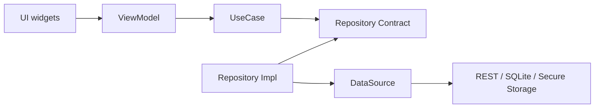
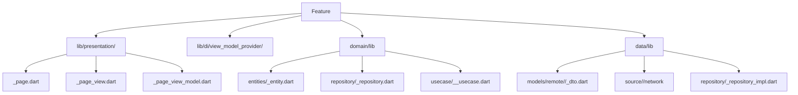
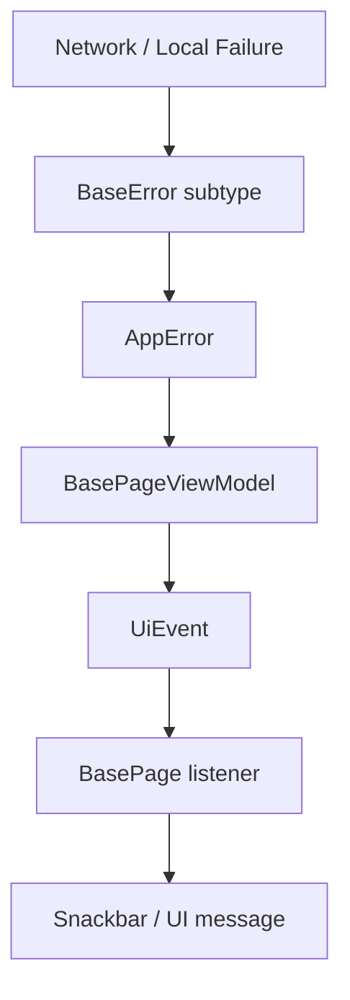

# Architecture Diagrams

## Clean Architecture

```mermaid
flowchart LR
  UI["UI widgets"] --> VM["ViewModel"]
  VM --> UC["UseCase"]
  UC --> REPO["Repository Contract"]
  IMPL["Repository Impl"] --> REPO
  IMPL --> DS["DataSource"]
  DS --> IO["REST / SQLite / Secure Storage"]
```

## Feature File Map

```mermaid
flowchart TD
  Feature["Feature"] --> Presentation["lib/presentation/<feature>"]
  Feature --> Provider["lib/di/view_model_provider/<feature>"]
  Feature --> Domain["domain/lib"]
  Feature --> Data["data/lib"]

  Presentation --> Page["<feature>_page.dart"]
  Presentation --> View["<feature>_page_view.dart"]
  Presentation --> VM["<feature>_page_view_model.dart"]

  Domain --> Entity["entities/<feature>_entity.dart"]
  Domain --> Contract["repository/<feature>_repository.dart"]
  Domain --> UseCase["usecase/<action>_<feature>_usecase.dart"]

  Data --> DTO["models/remote/<feature>/<feature>_dto.dart"]
  Data --> Source["source/<feature>/network"]
  Data --> RepoImpl["repository/<feature>_repository_impl.dart"]
```

## Error Flow

```mermaid
flowchart TD
  Failure["Network / Local Failure"] --> BaseError["BaseError subtype"]
  BaseError --> AppError["AppError"]
  AppError --> VM["BasePageViewModel"]
  VM --> UiEvent["UiEvent"]
  UiEvent --> Page["BasePage listener"]
  Page --> SnackBar["Snackbar / UI message"]
```

